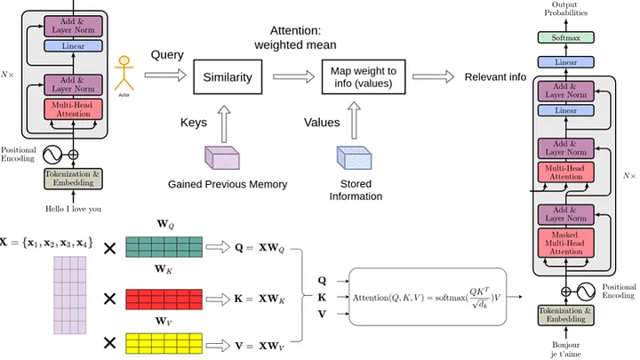
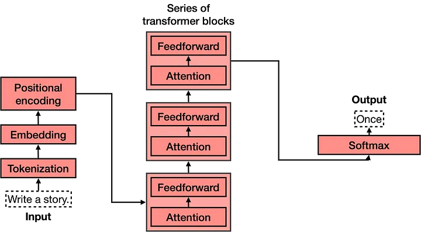
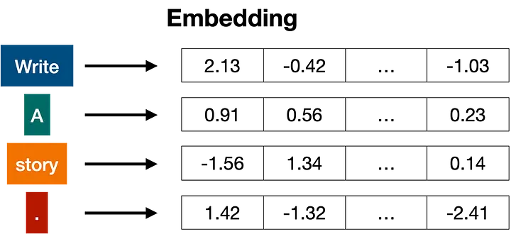
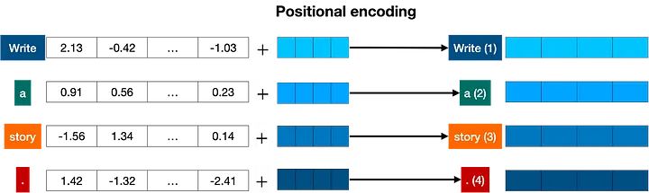
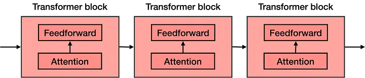
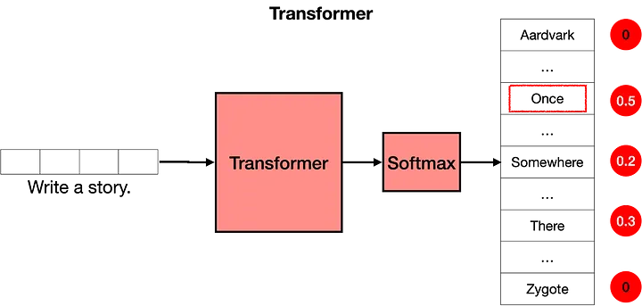

# Chat GPT
* The math behind ChatGPT, like its predecessor GPT-3, relies on a deep learning architecture called a Transformer. 
* Transformers are a type of neural network architecture that has proven to be highly effective for various natural language processing tasks, including language generation, translation, and question answering.
* Here's a simplified overview of the key mathematical components and concepts behind ChatGPT:
    
    1. 'Neural Networks': At the core of ChatGPT is a neural network. This network consists of layers of 
       interconnected artificial neurons, each performing simple mathematical operations.
    2. Embeddings: Words or tokens from the input text are first converted into numerical representations called embeddings. These embeddings are learned during training and capture the semantic meaning of the words or tokens.
    3. Self-Attention Mechanism: The heart of the Transformer architecture is the self-attention mechanism. It allows the model to weigh the importance of different parts of the input text when processing each word or token. This attention mechanism is computed through a series of mathematical operations.
    4. Multi-Head Attention: The self-attention mechanism is often used in multiple "heads" in parallel. Each head learns different relationships in the input data, and the results are combined to capture a richer context.
    5. Positional Encoding: Unlike recurrent neural networks (RNNs) and LSTMs, Transformers do not inherently consider the order of words in a sequence. To address this, positional encodings are added to the embeddings to provide the model with information about the position of each word in the input sequence.
    6. Feedforward Layers: After attention mechanisms, feedforward neural networks are applied to transform the information and capture complex patterns.
    7. Layer Normalization and Residual Connections: These techniques help stabilize and speed up training by preventing the gradients from becoming too small or too large during backpropagation.
    8. Training: The model is trained using a large dataset of text, where the objective is to minimize a loss function that measures the difference between the model's predictions and the actual target text. This training involves a process called gradient descent, which adjusts the model's parameters to improve its performance.
    9. Fine-Tuning: Once pre-trained on a large dataset, models like ChatGPT can be fine-tuned on specific tasks or domains to improve their performance on those tasks.
    
* The math involved in training and using ChatGPT is highly complex and relies on linear algebra, calculus, and optimization techniques. During inference (when you use the model to generate text), forward and backward passes through the network involve matrix multiplications, activation functions, and gradient computations.
* In summary, ChatGPT's math is grounded in deep learning principles and the Transformer architecture, which combines 
  various mathematical components to process and generate human-like text based on the patterns and relationships it has learned from large datasets

#### Transformer Architecture

#### Explanation
#### Reference : https://medium.com/@amanatulla1606/transformer-architecture-explained-2c49e2257b4c

    
    - Transformer models are one of the most exciting new developments in machine learning. 
    - They were introduced in the paper Attention is All You Need. 
    - Transformers can be used to write stories, essays, poems, answer questions, translate between languages, chat with humans, and they can even pass exams that are hard for humans! 
    - But what are they? You’ll be happy to know that the architecture of transformer models is not that complex, it simply is a concatenation of some very useful components, each of which has its own function.
#### Example

    
    - what does a transformer do? Imagine that you’re writing a text message on your phone. 
    - After each word, you may get three words suggested to you. For example, if you type “Hello, how are”, the phone may suggest words such as “you”, or “your” as the next word. Of course, if you continue selecting the suggested word in your phone, you’ll quickly find that the message formed by these words makes no sense. If you look at each set of 3 or 4 consecutive words, it may make sense, but these words don’t concatenate to anything with a meaning. This is because the model used in the phone doesn’t carry the overall context of the message, it simply predicts which word is more likely to come up after the last few. Transformers, on the other hand, keep track of the context of what is being written, and this is why the text that they write makes sense.

    Command: Write a story.
    Response: Once
    
    Next command: Write a story. Once
    Response: upon
    
    Next command: Write a story. Once upon
    Response: a
    
    Next command: Write a story. Once upon a
    Response: time
    
    Next command: Write a story. Once upon a time
    Response: there

#### Important Blocks of transformer
    Tokenization
    Embedding
    Positional encoding
    Transformer block (several of these)
    Softmax

#### Tokenization

#### Embeddings

#### Positional Encoding

#### Transformer block

    
    - The attention component.
    Attention is a very useful technique that helps language models understand the context. In order to understand how attention works, consider the following two sentences:

    Sentence 1: The bank of the river.
    Sentence 2: Money in the bank.
    As you can see, the word ‘bank’ appears in both, but with different definitions. In sentence 1, we are referring to the land at the side of the river, and in the second one to the institution that holds money.

            
    The attention step used in transformer models is actually much more powerful, and it’s called multi-head attention. In multi-head attention, several different embeddings are used to modify the vectors and add context to them. Multi-head attention has helped language models reach much higher levels of efficacy when processing and generating text.
    - The feedforward component.
#### Softmax

    Now that you know that a transformer is formed by many layers of transformer blocks, each containing an attention and a feedforward layer, you can think of it as a large neural network that predicts the next word in a sentence. The transformer outputs scores for all the words, where the highest scores are given to the words that are most likely to be next in the sentence.
   
    The last step of a transformer is a softmax layer, which turns these scores into probabilities (that add to 1), where the highest scores correspond to the highest probabilities. Then, we can sample out of these probabilities for the next word. In the example below, the transformer gives the highest probability of 0.5 to “Once”, and probabilities of 0.3 and 0.2 to “Somewhere” and “There”. Once we sample, the word “once” is selected, and that’s the output of the transformer.

