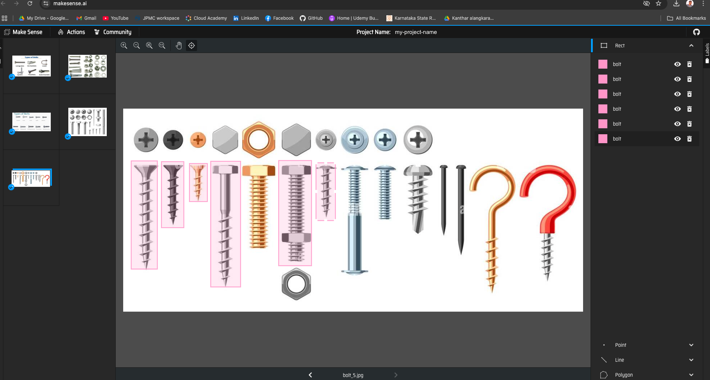

### Online annotation
    https://www.makesense.ai/

        dataset
        ├── images
        │   └── train
        │       └── bolt_1.jpg
        ├── labels
        │   └── train
        │       └── bolt_1.txt

    pip install ultralytics

# Train model using the dataset
    yolo detect train model=yolov8n.pt data=data.yaml epochs=100 imgsz=640
    
    
    (base) sathishkumarchandran@Sathishs-MacBook-Air bolt_detector % yolo detect predict model=runs/detect/train2/weights/best.pt source=dataset/images/train1
    Ultralytics 8.3.144 🚀 Python-3.11.5 torch-2.1.0 CPU (Apple M1)
    
    Model summary (fused): 72 layers, 3,005,843 parameters, 0 gradients, 8.1 GFLOPs
    image 1/5 /Users/sathishkumarchandran/IdeaProjects/llm/image_processing/bolt_detector/dataset/images/train1/bolt_1.jpeg: 384x640 2 bolts, 41.5ms
    image 2/5 /Users/sathishkumarchandran/IdeaProjects/llm/image_processing/bolt_detector/dataset/images/train1/bolt_2.jpeg: 384x640 (no detections), 40.1ms
    image 3/5 /Users/sathishkumarchandran/IdeaProjects/llm/image_processing/bolt_detector/dataset/images/train1/bolt_3.jpg: 320x640 9 bolts, 37.3ms
    image 4/5 /Users/sathishkumarchandran/IdeaProjects/llm/image_processing/bolt_detector/dataset/images/train1/bolt_4.jpg: 480x640 3 bolts, 51.9ms
    image 5/5 /Users/sathishkumarchandran/IdeaProjects/llm/image_processing/bolt_detector/dataset/images/train1/bolt_5.jpg: 288x640 4 bolts, 34.5ms
    Speed: 1.2ms preprocess, 41.1ms inference, 0.3ms postprocess per image at shape (1, 3, 288, 640)
    Results saved to runs/detect/predict5
    
    bolt_detector.py -> image
    bolt_detector_video.py -> video

    0: 384x640 1 bolt, 42.1ms
    Speed: 1.2ms preprocess, 42.1ms inference, 4.8ms postprocess per image at shape (1, 3, 384, 640)
    [Frame 195] Bolt detected!

