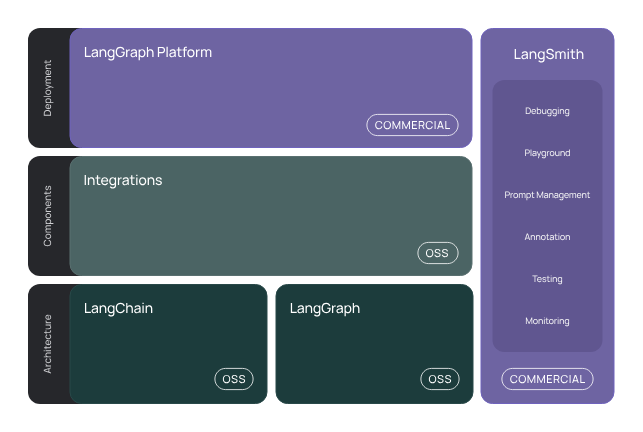

### Lang chain/graph/smith

### set up  
    https://python.langchain.com/v0.1/docs/integrations/chat/groq/
    https://medium.com/the-ai-forum/build-a-reliable-rag-agent-using-langgraph-2694d55995cd

#### Different types of Agent   
    Choosing the Right Agent
    Agent Type	            Best For	            Uses Tools?	Memory Support?
    Zero-Shot ReAct	        Basic reasoning	        ❌ No	❌ No
    OpenAI Functions	    Function calling	    ✅ Yes	❌ No
    ReAct Agent	            Step-by-step execution	✅ Yes	❌ No
    Conversational Agent	Chatbots	            ✅ Yes	✅ Yes
    Self-Querying Agent	    Dynamic search	        ✅ Yes	❌ No
    Plan-and-Execute	    Complex workflows	    ✅ Yes	✅ Yes