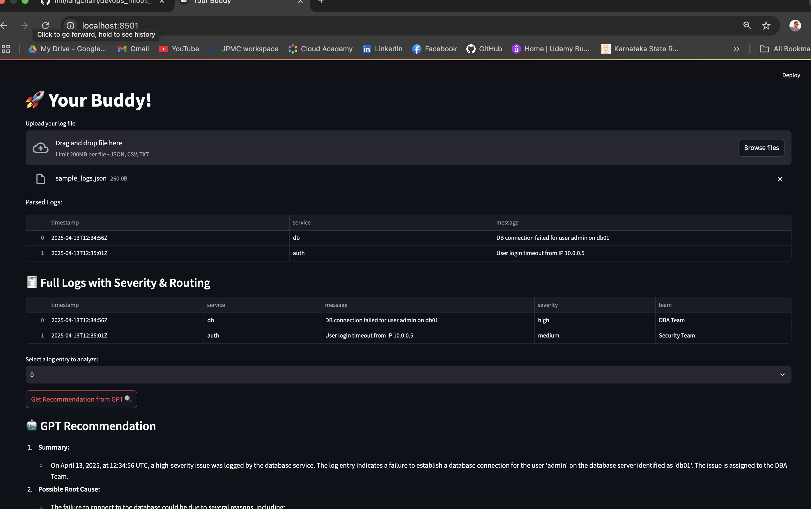

### Project structure
    devops_mlops_buddy/
    ├── app.py                  # Streamlit app
    ├── log_parser.py           # Log ingestion + preprocessing
    ├── analyzer.py             # Custom analytics + severity detection
    ├── openai_agent.py         # GPT-based recommendations
    ├── data/
    │   └── sample_logs.json
    ├── .env                    # For OpenAI API key
    └── requirements.txt

### Run the project
    
    python 3.11
    pip insatll -r requirement.txt
    streamlit run app.py

### Streamlit App
