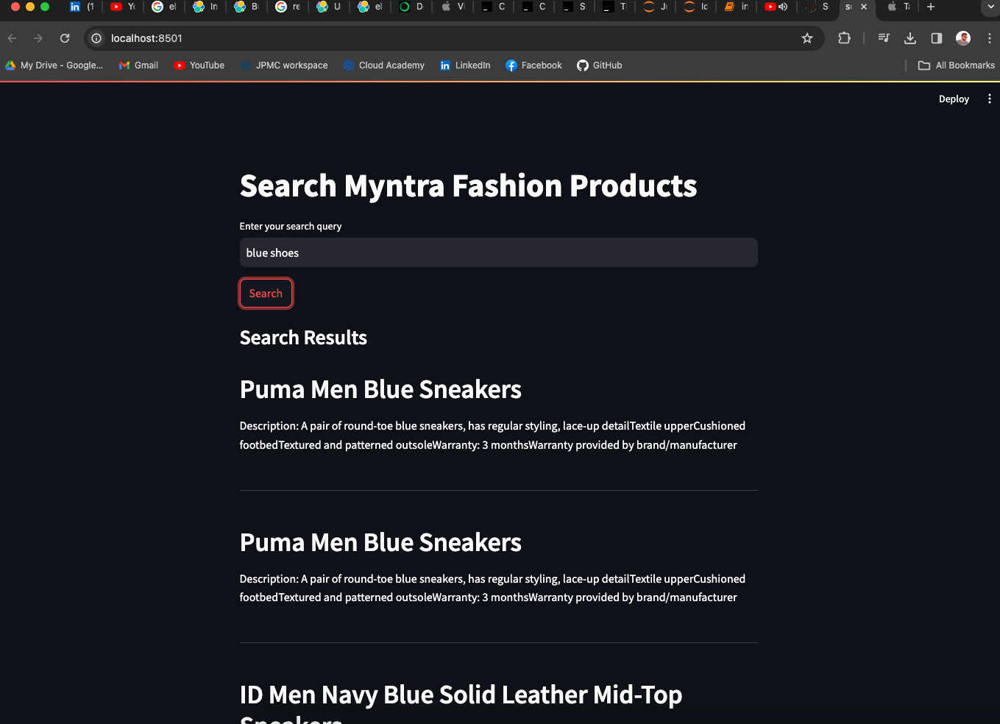
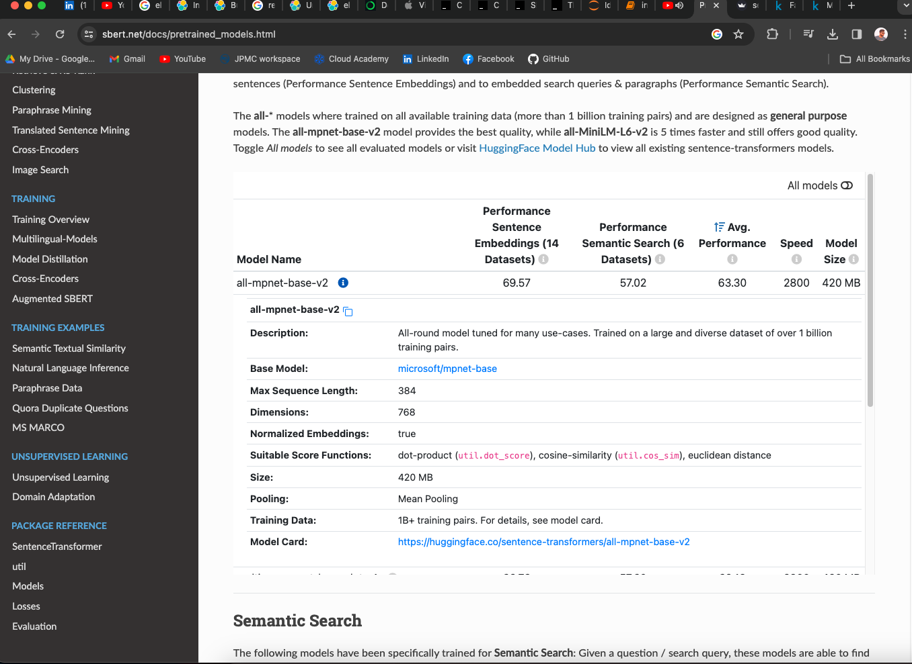

# Vector DB + LLM model
## Elastic search 
## Download and Install Elastic search
#### Ref : https://www.elastic.co/guide/en/elasticsearch/reference/current/targz.html
    
    curl -O https://artifacts.elastic.co/downloads/elasticsearch/elasticsearch-8.11.0-darwin-x86_64.tar.gz
    curl https://artifacts.elastic.co/downloads/elasticsearch/elasticsearch-8.11.0-darwin-x86_64.tar.gz.sha512 | shasum -a 512 -c -
    tar -xzf elasticsearch-8.11.0-darwin-x86_64.tar.gz
    cd elasticsearch-8.11.0/

    Start elastic serach
    
    sathishkumarchandran@Sathishs-MacBook-Air elasticsearch-8.11.0 % ./bin/elasticsearch
    
    Elastic password reset
    
    sathishkumarchandran@Sathishs-MacBook-Air elasticsearch-8.11.0 % bin/elasticsearch-reset-password -u elastic interactive
    .......... 
    Password for the [elastic] user successfully reset.
    New value: 2_GVpd5-eAWZf10CGmxS
    
    To check if elastic is working
    
    export ELASTIC_PASSWORD="2_GVpd5-eAWZf10CGmxS"
    export ES_HOME="/Users/sathishkumarchandran/elasticsearch-8.11.0"
    curl --cacert $ES_HOME/config/certs/http_ca.crt -u elastic:$ELASTIC_PASSWORD https://localhost:9200
    
    {
    "name" : "Sathishs-MacBook-Air.local",
    "cluster_name" : "elasticsearch",
    "cluster_uuid" : "rNk_pEq0SKaIIJzBRYHlnA",
    "version" : {
    "number" : "8.11.0",
    "build_flavor" : "default",
    "build_type" : "tar",
    "build_hash" : "d9ec3fa628c7b0ba3d25692e277ba26814820b20",
    "build_date" : "2023-11-04T10:04:57.184859352Z",
    "build_snapshot" : false,
    "lucene_version" : "9.8.0",
    "minimum_wire_compatibility_version" : "7.17.0",
    "minimum_index_compatibility_version" : "7.0.0"
    },
    "tagline" : "You Know, for Search"
    }

### LLM model to get the embeddings
    Ref : https://github.com/abidsaudagar/semantic-search-elastic-search-and-BERT-vector-embedding
    Ref : https://www.sbert.net/   
    Ref data : Kaggle - https://www.kaggle.com/datasets/shivamb/fashion-clothing-products-catalog
    
    Python - Anacoda python 3.11
    pip install -r requirements.txt
    streamlit run searchApp.py

    